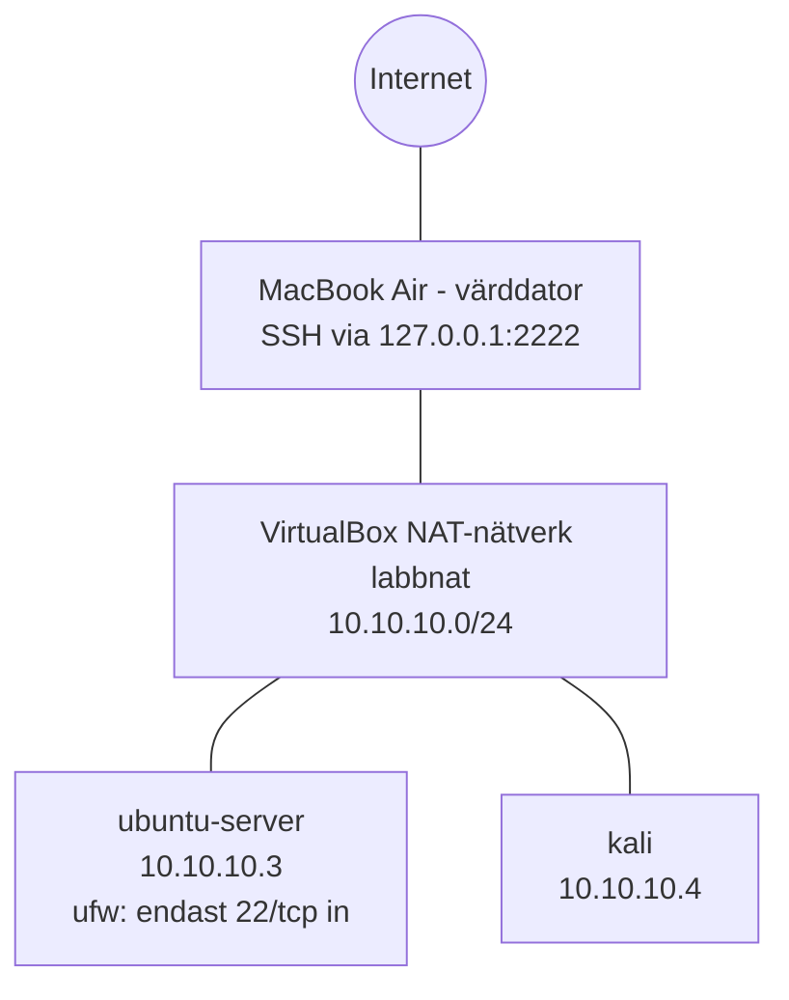

# Hemmalabb för cybersäkerhet

Ett virtuellt labb som jag byggt från grunden för att öva på
nätverk, Linux och säkerhet. Labbet körs i VirtualBox på en
MacBook Air med begränsade resurser (2 kärnor, 8 GB RAM), vilket
har styrt flera av valen nedan.

Hela arbetet är dokumenterat steg för steg i [labblogg.md](labblogg.md).

## Översikt

| Maskin | Operativsystem | Roll | IP-adress |
|---|---|---|---|
| ubuntu-server | Ubuntu Server 26.04.1 LTS | Härdad server, mål för övningar | 10.10.10.3 |
| kali | Kali Linux 2026.2 (Xfce) | Arbetsstation för säkerhetsverktyg | 10.10.10.4 |

Båda maskinerna sitter på ett eget NAT-nätverk (10.10.10.0/24).
De når varandra och internet, men kan inte nås utifrån. Servern
administreras via SSH från värddatorn genom port forwarding som
bara lyssnar på 127.0.0.1.

## Härdning av servern

| Område | Före | Efter |
|---|---|---|
| SSH-inloggning | Lösenord tillåtet | Endast nyckel (ed25519) |
| Root via SSH | Endast med nyckel | Helt avstängt |
| Brandvägg | Inaktiv | ufw aktiv, neka inkommande, endast 22/tcp öppen |
| Säkerhetsuppdateringar | Förinställt | Verifierat: tjänst, inställning och schema |

Härdningen av SSH ligger samlad i en egen fil,
`/etc/ssh/sshd_config.d/01-hardening.conf`, som läses före
installationens standardfil. Varje ändring testades i ett separat
fönster med en öppen session som säkerhetsnät.

## Säkerhetsval

- **Verifierade nedladdningar:** SHA256-kontrollsummor för VirtualBox,
  Ubuntu och Kali kontrollerades mot officiella källor före installation.
- **Verifierade fingeravtryck** vid första SSH-anslutningen till både
  GitHub och servern, som skydd mot man-in-the-middle-attacker.
- **En SSH-nyckel per syfte:** separata nycklar för GitHub och labbet,
  båda skyddade med lösenfras.
- **Minsta möjliga exponering:** port forwarding bunden till
  127.0.0.1, så att andra på samma nätverk inte når servern.
- **Kontosäkerhet på GitHub:** tvåfaktorsautentisering och dold
  e-postadress (noreply).
- **Användarkonton:** icke-förutsägbara användarnamn och unika
  lösenord i lösenordshanterare.
- **Ingen diskkryptering (LUKS)** i labbet, ett medvetet val eftersom
  maskinerna saknar känslig data. I produktion vore det ett krav.
- **Ögonblicksbilder** före och efter härdning, så att labbet snabbt
  kan återställas.

## Vad jag har lärt mig

- Virtualisering och resursplanering med begränsad hårdvara
- Installation, uppdatering och härdning av Linux-server
- SSH: nyckelpar, authorized_keys, sshd-konfiguration och port forwarding
- Brandvägg med ufw enligt principen default deny
- Grundläggande nätverk: privata IP-adresser, CIDR, DHCP, NAT,
  gateway, broadcast och IPv6 link-local
- Felsökning med ip a, ping, sshd -T och systemctl
- Git och GitHub via terminalen
- Dokumentation i Markdown

## Nästa steg

- Analysera trafik mellan maskinerna med Wireshark
- Utöka serverns rotfilsystem till hela disken med LVM