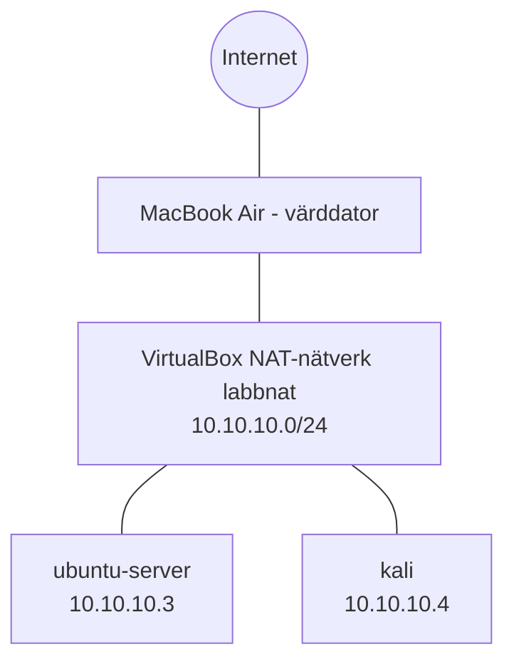

# Hemmalabb för cybersäkerhet

Ett virtuellt labb som jag byggt från grunden för att öva på
nätverk, Linux och säkerhet. Labbet körs i VirtualBox på en
MacBook Air med begränsade resurser (2 kärnor, 8 GB RAM), vilket
har styrt flera av valen nedan.

Hela arbetet är dokumenterat steg för steg i [labblogg.md](labblogg.md).

## Översikt

| Maskin | Operativsystem | Roll | IP-adress |
|---|---|---|---|
| ubuntu-server | Ubuntu Server 26.04.1 LTS | Server, mål för övningar | 10.10.10.3 |
| kali | Kali Linux 2026.2 (Xfce) | Arbetsstation för säkerhetsverktyg | 10.10.10.4 |

Båda maskinerna sitter på ett eget NAT-nätverk (10.10.10.0/24).
De når varandra och internet, men kan inte nås utifrån.

## Säkerhetsval

- **Verifierade nedladdningar:** SHA256-kontrollsummor för VirtualBox,
  Ubuntu och Kali kontrollerades mot officiella källor före installation.
- **Kontosäkerhet på GitHub:** tvåfaktorsautentisering, dold e-postadress
  (noreply) och SSH-nyckel (ed25519) med lösenfras.
- **Verifierat värdfingeravtryck** vid första SSH-anslutningen till GitHub,
  som skydd mot man-in-the-middle-attacker.
- **Användarkonton:** icke-förutsägbara användarnamn istället för admin
  eller root, och unika lösenord i lösenordshanterare.
- **Manuell installation** istället för obevakad, för full kontroll
  över alla val.
- **Ingen diskkryptering (LUKS)** i labbet, ett medvetet val eftersom
  maskinerna saknar känslig data. I produktion vore det ett krav.
- **Ögonblicksbilder** av rena, uppdaterade installationer, så att
  labbet snabbt kan återställas.
- **.gitignore** som utesluter macOS-filen .DS_Store, som kan
  avslöja filstruktur.

## Vad jag har lärt mig

- Virtualisering och resursplanering med begränsad hårdvara
- Installation och uppdatering av Linux (apt, sudo)
- Grundläggande nätverk: privata IP-adresser, CIDR, DHCP, NAT,
  broadcast och IPv6 link-local
- Felsökning med ip a och ping
- Git och GitHub via terminalen, med SSH-autentisering
- Dokumentation i Markdown

## Nästa steg

- Byta SSH-inloggning på servern från lösenord till nyckel
- Härda servern och dokumentera före och efter
- Analysera trafik mellan maskinerna med Wireshark