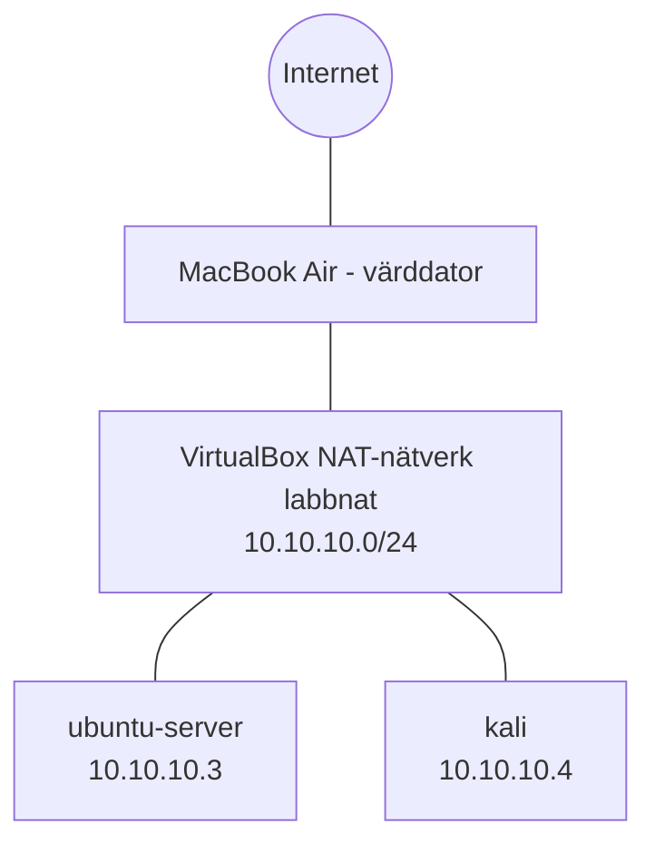

# Labblogg – Hemmalabb

## 2026-09-24 – Steg 1: Kontroll av dator och förberedelser
- Dator: MacBook Air 2020, Intel Core i3 (2 kärnor), 8 GB RAM, macOS Sequoia
- Virtualisering: stöds (Intel-Mac)
- Ledigt diskutrymme: 96,6 GB
- Beslut: Kör max två VM samtidigt. Ubuntu Server utan GUI.
  Skippar brandvägg i första versionen p.g.a. begränsat RAM.
- Beslut: Projektmappen ligger i hemkatalogen, inte i iCloud,
  eftersom iCloud-synk kan skapa konflikter med Git.
  GitHub fungerar som säkerhetskopia.

## 2026-09-24 – Steg 2: GitHub
- Bytt användarnamn till askats, lämnar visningsnamnet tomt tills vidare
- Aktiverat tvåfaktorsautentisering med autentiseringsapp
- Döljer e-postadressen och använder GitHubs noreply-adress
- Skapat publikt repo "hemmalabb"

## 2026-09-24 – Steg 3: Git
- Kontrollerat att Git finns installerat: version 2.39.5 (Apple Git-154)
- Konfigurerat Git globalt via Terminalen:
  - Användarnamn: askats
  - E-post: GitHubs noreply-adress, så att min riktiga e-post
    inte syns i uppladdningar
  - Standardgren: main (samma som GitHubs standard)
- Kontrollerat inställningarna med: git config --global --list
- Notering: Terminalens prompt visar mitt riktiga namn och datornamn.
  Måste döljas i skärmdumpar och utskrifter som publiceras.

## 2026-09-24 – Steg 4: Koppla projektet till GitHub
- Gjort projektmappen till ett Git-repo (git init)
- Skapat .gitignore som utesluter macOS-filen .DS_Store,
  eftersom den kan avslöja mappnamn och filstruktur
- Skapat en SSH-nyckel (ed25519) skyddad med lösenfras,
  sparad i macOS nyckelring
- Lagt till den publika nyckeln på GitHub
- Verifierat GitHubs officiella fingeravtryck innan första
  anslutningen, som skydd mot man-in-the-middle-attacker
- Gjort första uppladdningen (push) till GitHub

## 2026-09-24 – Steg 5: VirtualBox
- Laddat ner VirtualBox 7.2.20 för Intel-Mac från virtualbox.org
- Verifierat filens SHA256-kontrollsumma mot den officiella listan
  för att säkerställa att filen är äkta och oförändrad
- Installerat VirtualBox och raderat installationsfilen efteråt
- macOS meddelade att VirtualBox lagt till bakgrundsobjekt.
  Förväntat, eftersom VirtualBox behöver en hjälptjänst.
  Notering: oväntade bakgrundsobjekt kan vara tecken på
  skadlig kod som försöker uppnå persistens.

## 2026-09-24 – Steg 6: Operativsystem
- Laddat ner Ubuntu Server 26.04.1 LTS (amd64) från ubuntu.com
- Laddat ner Kali Linux 2026.2 installer (amd64) från kali.org
- Verifierat båda filernas SHA256-kontrollsummor mot de officiella
  (shasum -a 256 --check gav OK för båda)
- Valde Ubuntu Server LTS eftersom den får långvariga
  säkerhetsuppdateringar och är vanlig i företagsmiljöer
- Valde Kalis installer istället för färdig VM-avbild för att
  själv välja användarnamn och lösenord, istället för
  standardinloggningen kali/kali som alla känner till

## 2026-09-24 – Steg 7: Ubuntu Server
- Skapat VM "ubuntu-server" i VirtualBox: 1 CPU, 25 GB dynamisk disk,
  2048 MB RAM under installation, sänkt till 1024 MB efteråt
- Installerat Ubuntu Server 26.04.1 LTS manuellt, utan obevakad
  installation, för att själv kontrollera alla val
- Disk: LVM utan LUKS-kryptering. Medvetet val eftersom labbet
  saknar känslig data och kryptering kräver lösenfras vid varje
  start. I produktion med känslig data är diskkryptering viktig.
- Användare: "labbadmin", inte mitt riktiga namn och inte
  förutsägbara namn som admin eller root. Unikt lösenord,
  sparat i lösenordshanterare
- Installerat OpenSSH-server. Lösenordsinloggning tillåten
  tills vidare, ska ersättas med nyckelinloggning senare
- Uppdaterat systemet med sudo apt update och sudo apt upgrade
- IP-adress i VirtualBox NAT-nätverk: 10.0.2.15/24
- Tagit ögonblicksbild "Ren installation, uppdaterad"

## 2026-09-24 – Steg 8: Kali Linux
- Skapat VM "kali" i VirtualBox: 1 CPU, 2048 MB RAM,
  25 GB dynamisk disk
- Installerat Kali Linux 2026.2 med grafisk installation
- Användare: "labbkali", eget unikt lösenord, sparat i
  lösenordshanterare. Separat användarnamn från servern
  för att lättare skilja maskinerna åt i loggar
- Valde skrivbordsmiljön Xfce, den lättaste, p.g.a.
  begränsat RAM. Verktygspaket: top10 och default
- Uppdaterat med sudo apt full-upgrade
- IP-adress: 10.0.2.15/24, samma som servern
- Observation: Båda maskinerna använder VirtualBox NAT-läge,
  där varje maskin får ett eget isolerat nätverk. De når
  internet men inte varandra. Nästa steg: gemensamt nätverk.
- Tagit ögonblicksbild "Ren installation, uppdaterad"

## 2026-09-24 – Steg 9: Gemensamt nätverk
- Skapat NAT-nätverket "labbnat" i VirtualBox: 10.10.10.0/24, DHCP aktiverat
- Kopplat båda maskinerna till labbnat istället för vanligt NAT-läge,
  så att de kan nå varandra och internet, men inte nås utifrån
- Adresser via DHCP: ubuntu-server 10.10.10.3, kali 10.10.10.4
- Testat med ping:
  - Kali till servern: 0% paketförlust
  - Servern till Kali: 0% paketförlust
  - Kali till internet (8.8.8.8): 0% paketförlust, cirka 20 ms
- Felsökning: "Name or service not known" vid ping berodde på ett
  skrivfel i IP-adressen. Ping tolkade texten som ett värdnamn.

### Nätverkskarta

## 2026-09-25 – Härdning, steg 1–4: SSH-inloggning med nyckel
- Port forwarding i labbnat: 127.0.0.1:2222 på Macen till 10.10.10.3:22.
  Bunden till 127.0.0.1 så att bara Macen själv kan nå porten,
  inte andra enheter på samma wifi
- Verifierat serverns ED25519-fingeravtryck med ssh-keygen -lf
  innan första anslutningen
- Skapat en separat SSH-nyckel (labb_ed25519) med lösenfras,
  enligt principen en nyckel per syfte
- Lagt in den publika nyckeln på servern med ssh-copy-id och
  kontrollerat att authorized_keys bara innehåller den nyckeln
- Skapat genvägen "labbserver" i ~/.ssh/config, med
  IdentitiesOnly så att GitHub-nyckeln aldrig skickas till servern
- Resultat: inloggning med nyckel fungerar utan serverlösenord
- Observation: inloggningar syns från 10.10.10.1 (NAT-nätverkets
  gateway), inte från Macens adress. Viktigt att veta vid logganalys.
- Observation: rotfilsystemet använder bara 11,2 GB av disken
  på 25 GB. Ubuntus LVM-förval lämnar resten oanvänt.
- Lärdom: råkade klistra in ett lösenord i terminalen. Raderade
  raden ur ~/.zsh_history, eftersom terminalhistorik sparar allt.